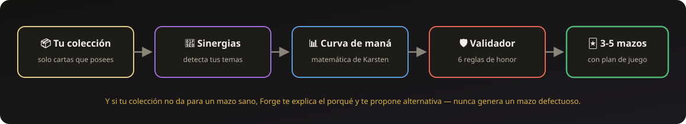

<p align="center">
  
</p>

<p align="center"><a href="README.en.md">🇬🇧 English</a> · <a href="../../README.md">🇪🇸 Español</a> · <a href="README.de.md">🇩🇪 Deutsch</a> · <b>🇫🇷 Français</b> · <a href="README.it.md">🇮🇹 Italiano</a> · <a href="README.pt.md">🇵🇹 Português</a> · <a href="README.ru.md">🇷🇺 Русский</a> · <a href="README.zh.md">🇨🇳 中文</a> · <a href="README.ja.md">🇯🇵 日本語</a> · <a href="README.ko.md">🇰🇷 한국어</a></p>

<p align="center">
  <a href="https://github.com/AAlexmc/Manaforge/actions/workflows/ci.yml"></a>
  <a href="https://github.com/AAlexmc/Manaforge/actions/workflows/build-card-db.yml"></a>
  <a href="../../LICENSE"></a>
  
  
</p>

<p align="center">
  <b><a href="#forge">Forge</a></b> ·
  <b><a href="#features">Fonctionnalités</a></b> ·
  <b><a href="#download">Télécharger</a></b> ·
  <b><a href="#architecture">Architecture</a></b> ·
  <b><a href="#roadmap">Feuille de route</a></b> ·
  <b><a href="#contributing">Contribuer</a></b>
</p>

> [!TIP]
> **« Quels decks je peux monter avec ce que je possède DÉJÀ ? »** C'est la question à laquelle aucune appli Magic ne répond bien — et la seule raison d'être de ManaForge. Les autres t'aident à *cataloguer* ta boîte de cartes ; celle-ci la transforme en decks prêts à mélanger.

On est tous passés par là : une boîte pleine de cartes issues de boosters, de decks de démarrage et de tiroirs hérités… et aucune idée de quoi construire avec. ManaForge est faite par des joueurs, pour des joueurs : **gratuite, sans pub, sans premium, sans compte, et avec tout le code à découvert.**

<p align="center"></p>

<a id="forge"></a>
## ⚒️ Forge : le générateur de decks

Tu lui donnes ta collection et il te rend **des decks complets de 60 cartes**, construits comme le ferait un joueur vétéran. Voilà comment il réfléchit :

<p align="center">
  
</p>

- 🏔️ **Une vraie courbe de mana** — terrains selon l'archétype, sources réparties par symboles de couleur, courbe validée. Pas de decks à 15 terrains ici.
- 🧬 **Synergies détectées** — Forge lit le texte de règles de chaque carte et trouve tes thèmes : drain de vie, sacrifice, artefacts, go-wide, spellslinger, marqueurs…
- 🗺️ **Un plan de jeu expliqué** — tour par tour, plus un *« Pourquoi ce deck fonctionne ? »* dépliable pour qui veut la théorie.
- 🤝 **Règles d'honneur** — il n'utilise jamais de cartes que tu ne possèdes pas, ne dépasse jamais la limite de copies, et plutôt que de générer un deck bancal, il t'explique pourquoi et te propose une alternative.
- 🎯 **Choisis ton style** — impose une tribu (Elfes, Zombies, Dragons… 24 sélectionnées avec soin, plus n'importe quel sous-type avec assez de créatures) ou un thème mécanique, et le moteur obéit. En Auto, il détecte celui que ta collection récompense le mieux.
- ⚔️ **Forge profonde** — avant d'être montrés, les decks candidats jouent des centaines de parties entre eux : le classement final pèse leurs performances réelles, pas seulement leur score sur le papier.
- 🎲 **De la vraie probabilité** — consistance (est-ce que tu pioches tes terrains à temps ?) et courbe jouable calculées avec des maths hypergéométriques ; les terrains non-base (shocklands, checklands, fetchlands) comptent pour ce qu'ils font vraiment.
- 📤 **Export en un clic** — copie la liste et colle-la dans Moxfield, MTG Arena ou le Discord de ton groupe de jeu.

<p align="center">
  
</p>
<p align="center"><sub><i>La vraie collection qui a vu naître ManaForge — le générateur a transformé ces cartes (et 280 autres) en cinq decks jouables.</i></sub></p>

<p align="center"></p>

<a id="features"></a>
## ✨ Ce qu'elle fait aujourd'hui

<table>
  <tr>
    <td align="center" width="33%">
      <h3>🗃️</h3><b>Toute l'histoire de Magic<br/>dans ta poche</b><br/><br/>
      <sub>Base de données complète (bulk Scryfall → SQLite) qui se reconstruit toute seule chaque mois en CI. Tu la télécharges une fois et tout fonctionne <b>hors ligne</b>.</sub>
    </td>
    <td align="center" width="33%">
      <h3>🔍</h3><b>Recherche en<br/>espagnol et en anglais</b><br/><br/>
      <sub>« Elfos de Llanowar », « elfos de llanowar » sans accents, ou « Llanowar Elves » : tout mène à la même carte. Et avec l'appli en espagnol, decks et fiches de cartes affichent les noms en espagnol.</sub>
    </td>
    <td align="center" width="33%">
      <h3>📦</h3><b>Ta collection,<br/>visuelle et à toi</b><br/><br/>
      <sub><b>Scanne tes cartes à la webcam</b> (elle reconnaît l'édition exacte grâce à l'illustration), <b>importe ton CSV</b> depuis n'importe quelle autre appli, ou ajoute-les à la main. Tout reste en local : pas de compte, pas de cloud obligatoire.</sub>
    </td>
  </tr>
  <tr>
    <td align="center">
      <h3>⚒️</h3><b>Forge</b><br/><br/>
      <sub>Plusieurs propositions dans un carrousel comparable, une vue détaillée avec plan de jeu tour par tour, une courbe éditable qui reforge le deck, et un Mode Test pour l'opposer à un autre.</sub>
    </td>
    <td align="center">
      <h3>🌗</h3><b>Design soigné</b><br/><br/>
      <sub>Thème sombre, <b>10 langues complètes</b>, des visites guidées qui montrent l'appli de l'intérieur, une iconographie de mana lisible par les daltoniens et des microtextes de joueur à joueur.</sub>
    </td>
    <td align="center">
      <h3>🔐</h3><b>Vie privée par défaut</b><br/><br/>
      <sub>Pas d'analytics, pas de tracking, pas de « crée ton compte ». Le scanner reconnaît les cartes 100 % sur ton appareil.</sub>
    </td>
  </tr>
</table>

> [!NOTE]
> **Sur l'enclume :** des échanges entre collections, des noms de cartes dans plus de langues, et le mobile si la communauté le réclame.

<a id="download"></a>
## 🚀 Télécharge et lance-la

Va sur [**Releases**](https://github.com/AAlexmc/Manaforge/releases) et récupère le zip de ton système. Pas d'installateur, pas de compte : tu décompresses et tu ouvres.

| Système | Quoi faire |
|---|---|
| **Windows** | Décompresse et, dans le dossier `ManaForge`, ouvre `manaforge.exe`. La première fois, Windows préviendra qu'il ne connaît pas le programme : *Informations complémentaires → Exécuter quand même* (il n'est pas signé ; le code est juste là pour que tu l'inspectes). |
| **macOS** | Décompresse et ouvre-la une fois (tu auras un avertissement) ; ensuite va dans *Réglages Système → Confidentialité et sécurité → Ouvrir quand même*. (Depuis macOS 15, le clic droit → Ouvrir ne contourne plus l'avertissement.) |
| **Linux** | Décompresse et, dans le dossier `ManaForge`, lance `./manaforge`. Pour l'avoir dans ton menu d'applications avec son icône : `./instalar.sh` (tout va dans `~/.local`, pas de sudo ; ça se retire avec `./instalar.sh --desinstalar`). |

**Vérifie ce que tu as téléchargé** : chaque release publie `SHA256SUMS.txt` avec l'empreinte des trois zips. Sous Linux ou macOS, `sha256sum -c SHA256SUMS.txt` (ou `shasum -a 256 -c`) ; sous Windows, `Get-FileHash ManaForge-Windows.zip`.

Au premier lancement, l'appli télécharge **~36 Mo** de données (cartes et prix Scryfall, historique des prix et empreintes du scanner) et t'affiche la progression. À partir de là, elle fonctionne hors ligne.

Ensuite : **importe ta collection** depuis un CSV, **scanne** des cartes à la webcam ou depuis une photo, ou file droit vers **⚒️ Forge** et monte un deck à partir d'une collection donnée avant même d'en avoir une.

### Tu préfères la compiler toi-même ?

```bash
# Flutter, canal stable : https://docs.flutter.dev/get-started/install
# (sous Windows il faut Visual Studio avec « Développement Desktop en C++ »)
git clone https://github.com/AAlexmc/Manaforge.git
cd Manaforge/app
flutter run -d linux     # ou -d windows / -d macos
```

Les wrappers natifs Linux, Windows et macOS ainsi que le `pubspec.lock` sont dans le repo, donc ça compile tel quel sur les trois.

<a id="architecture"></a>
## 🔧 Comment c'est construit

| Dossier | Ce qui vit là |
|---|---|
| [`app/`](../../app) | L'appli Flutter — un seul code pour Windows, macOS et Linux (et le mobile un de ces jours) |
| [`forge_engine/`](../../forge_engine) | Le moteur de decks en Dart : courbe, validateur, classificateur et générateur |
| [`engine-reference/`](../../engine-reference) | Le même moteur en Python : la **référence canonique et testée** de l'algorithme |
| [`scripts/`](../../scripts) | Pipeline de données : bulk Scryfall → SQLite, exécuté uniquement sur GitHub Actions |
| [`DesignSystem/`](../../DesignSystem) | Tokens de design, icônes de mana en SVG et spécifications de composants |
| [`docs/`](../../docs) | Architecture des données, algorithme de Forge et conception du scanner |

Deux décisions définissent le projet. Un : **le moteur existe en double** — Python comme spécification exécutable et testée, Dart comme implémentation embarquée dans l'appli ; s'ils divergent, c'est Python qui a raison. Deux : **la base de données se construit toute seule** — un workflow télécharge le bulk Scryfall chaque mois et publie la SQLite comme [release](https://github.com/AAlexmc/Manaforge/releases/tag/card-db-latest), que l'appli récupère au premier lancement.

```bash
cd engine-reference && python3 -m pytest tests/   # tests de l'algorithme (canonique)
cd forge_engine && dart test                      # tests du moteur de l'appli
cd app && flutter test                            # tests de l'appli
```

<a id="roadmap"></a>
## 🗺️ Feuille de route

- [x] **Phase 1 — Fondations** : moteur de courbe et validateur (Python + Dart), design system, CI
- [x] **Phase 2 — Données** : pipeline bulk Scryfall → SQLite avec release mensuelle automatique
- [x] **Phase 3 — Générateur** : classification fonctionnelle, thèmes, scoring et construction greedy
- [x] **Phase 4 — App v0.2** : collection avec recherche ES/EN, importateur CSV, Forge avec carrousel et plan de jeu
- [x] **Phase 5 — Desktop de première classe** : builds automatiques Windows/macOS/Linux dans les Releases, decks sauvegardés, raccourcis clavier et une fenêtre qui se souvient de sa place
- [x] **Phase 6 — Finitions** : prix et valeur de la collection, P&L d'achat, légalités par format et **10 langues complètes**
- [x] **Phase 7 — Scanner** : empreintes perceptuelles générées en CI + webcam/photo, 100 % sur ton appareil ([comment ça marche à l'intérieur](../reconocimiento-cartas.md))
- [x] **Phase 7½ — Forge v2** : manabase probabiliste, score consistance-et-courbe, thèmes tribal/réanimation, sélecteur de style, forge profonde et noms de cartes en espagnol
- [ ] **Phase 8 — Échanges et communauté** : trocs entre collections, plus tout ce que demandera la [boîte à idées](https://github.com/AAlexmc/Manaforge/issues/new/choose)
- [ ] **Phase 9 — Mobile (si la communauté le réclame)** : Android et iOS/TestFlight — le code est prêt ; il ne manque que les comptes des stores

<a id="contributing"></a>
## 🤝 Contribuer

Ce projet veut appartenir à la communauté. Si tu t'y connais en Flutter, en vision par ordinateur (le scanner t'attend !), en théorie de construction de decks — ou si tu joues, tout simplement, et que tu as des idées — les issues et les PR sont ouvertes. Le code est commenté en espagnol, et la CI te préviendra si quelque chose casse avant que qui que ce soit ne se fâche.

### 💡 Boîte à idées

Pas besoin de savoir coder : si tu as une idée ou repéré un bug, dépose ça dans la [boîte à idées](https://github.com/AAlexmc/Manaforge/issues/new/choose) — il y a un modèle pour chaque cas et ça prend une minute. Tu peux aussi y accéder depuis l'appli : **Réglages → L'appli**.

<a id="donations"></a>
## 💜 Dons

ManaForge est gratuite et sans pub, et ça va le rester (la [licence](#license) interdit de la vendre). Mais si un jour Forge t'a construit le deck qui a gagné la partie, tu peux financer deux nobles causes : le café qui garde la forge allumée, et mes rigoureuses recherches de terrain consistant à ouvrir des *boosters collector* où jamais — **jamais** — rien ne tombe. Les données sont formelles : la prochaine grosse rare ne sortira pas ; l'espoir est la dernière chose qu'on exile.

<p align="center">
  <a href="https://paypal.me/al3payme">
    
  </a>
</p>

Et si ton mana est déjà engagé, la meilleure façon de soutenir le projet, c'est de l'utiliser, de me dire ce que tu améliorerais dans la [boîte à idées](https://github.com/AAlexmc/Manaforge/issues/new/choose) et de mettre une ⭐ au repo — les étoiles ne se défaussent pas à la fin du tour.

<p align="center"></p>

## 🙏 Crédits et mentions légales

Les données et les images des cartes viennent de [Scryfall](https://scryfall.com), envers qui notre gratitude est éternelle (tout comme notre respect de leurs [limites d'API](https://scryfall.com/docs/api)). Magic: The Gathering, ses cartes et ses illustrations sont la propriété de **Wizards of the Coast**. ManaForge est un projet de fans **non officiel** et gratuit, couvert par la [Fan Content Policy](https://company.wizards.com/en/legal/fancontentpolicy) ; il n'est ni produit, ni approuvé, ni sponsorisé par Wizards.

<a id="license"></a>
## 📄 Licence

[PolyForm Noncommercial 1.0.0](../../LICENSE). En clair :

- **Tu peux** l'utiliser, la copier, la modifier, la partager et publier tes propres versions, à la seule condition de transmettre la licence avec le code.
- **Tu ne peux pas** la vendre ni t'en servir pour gagner de l'argent : pas question de faire payer l'appli ou une version modifiée, de l'embarquer dans un produit ou un service payant, ni de l'utiliser au sein d'une entreprise pour son activité commerciale.
- **Tu peux** l'utiliser chez toi, ou dans ta boutique de quartier pour tes propres cartes… tant que tu ne vends pas l'appli et que tu ne fais payer personne pour elle.

Usage personnel, étude, bidouille, projets de passionné et associations sans but lucratif : allez-y, pas besoin de permission.

Attention : une licence avec restriction non commerciale n'est **pas** « open source » au sens de l'OSI. C'est du *source-available* : tu peux la lire, la retoucher et la partager, mais pas la vendre.

<p align="center">
  <sub>Fait avec ❤️ et beaucoup de mana par des joueurs de table de cuisine</sub><br/><br/>
  
  
  
  
  
</p>
